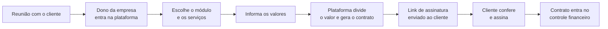

<h1 align="center">OmniTract</h1>

<p align="center">
  <strong>Gere contratos para os clientes da sua empresa ao fim de cada reunião.</strong><br>
  Informe os serviços e os valores, deixe a plataforma dividir o total, envie um link de assinatura e acompanhe o financeiro.
</p>

<p align="center">
  
  
  
</p>

---

## Sumário

- [Para que serve](#para-que-serve)
- [Como funciona](#como-funciona)
- [Módulos por área de atuação](#módulos-por-área-de-atuação)
- [Como o valor é dividido](#como-o-valor-é-dividido)
- [Controle financeiro](#controle-financeiro)
- [Os repositórios do projeto](#os-repositórios-do-projeto)
- [Tecnologias](#tecnologias)
- [Como acessar a documentação](#como-acessar-a-documentação)
- [Como usar](#como-usar)
- [Status do projeto](#status-do-projeto)
- [Contribuindo](#contribuindo)

## Para que serve

Depois de uma reunião com o cliente, o dono da empresa precisa transformar o que foi combinado em um contrato formal: montar o documento, distribuir o valor entre os serviços, enviar para assinatura e depois controlar o que foi cobrado.

O **OmniTract** faz esse caminho em poucos passos. Cada empresa (*tenant*) tem o próprio ambiente, com os próprios contratos, clientes e financeiro, sem misturar dados com outras empresas.

## Como funciona



1. **Crie o contrato.** Ao terminar a reunião, entre na plataforma e inicie um novo contrato.
2. **Escolha os serviços.** Selecione o módulo da sua atividade e os serviços que o cliente contratou.
3. **Informe o valor.** Digite o valor de cada serviço ou o valor total do contrato.
4. **Defina a divisão.** Se informou o total, escolha dividir igualmente ou por peso.
5. **Envie o link.** A plataforma gera um link para o cliente conferir e assinar.
6. **Acompanhe.** O contrato assinado passa a ser controlado no financeiro.

## Módulos por área de atuação

Cada empresa habilita os **módulos** que correspondem à sua atividade. Os **submódulos** de cada módulo são os serviços que podem ser contratados.

| Módulo | Exemplos de serviços contratáveis |
|---|---|
| **Serviços técnicos de TI** | firewall, load balancer, orchestrator, manutenção de computadores, cabeamento estruturado, CFTV e outros |
| **Desenvolvimento de software** | contratação de sprints individuais e outros |

Novos módulos podem ser adicionados para outras áreas de atuação.

## Como o valor é dividido

Você escolhe como informar o valor do contrato:

| Você informa | O OmniTract faz |
|---|---|
| O valor de **cada serviço** | Soma os itens e obtém o total do contrato |
| Um **valor total** com divisão **igual** | Divide o total em partes iguais entre os serviços |
| Um **valor total** com divisão **por peso** | Divide o total proporcionalmente ao peso de cada serviço |

**Exemplo:** contrato de R$ 10.000,00 com três serviços de pesos 1, 2 e 2.

| Serviço | Peso | Valor |
|---|---|---|
| Serviço A | 1 | R$ 2.000,00 |
| Serviço B | 2 | R$ 4.000,00 |
| Serviço C | 2 | R$ 4.000,00 |

## Controle financeiro

Um menu dedicado permite acompanhar o financeiro dos contratos fechados, organizado de acordo com o **perfil de período** de cada contrato.

## Os repositórios do projeto

O OmniTract é dividido em repositórios, um para cada parte da aplicação. Este repositório (`OmniTract/OmniTract`) é a vitrine do projeto.

| Repositório | Para que serve | Status |
|---|---|---|
| [`OmniTract`](https://github.com/OmniTract/OmniTract) | Apresentação do projeto (você está aqui) | Ativo |
| [`omnitract-docs`](https://github.com/OmniTract/omnitract-docs) | Documentação: visão do produto, arquitetura e convenções | Em criação |
| `omnitract-core` | Autenticação, autorização, tenants e módulos | Previsto |
| `omnitract-web` | Interface web responsiva, para usar no navegador | Previsto |
| `omnitract-docauth` | Assinatura e autenticação de documentos | Previsto |

Outros repositórios serão criados conforme o projeto evoluir.

## Tecnologias

| Camada | Tecnologia |
|---|---|
| Linguagem | TypeScript |
| Web | Next.js |
| Banco de dados | PostgreSQL com Prisma |
| Autenticação | Supabase Auth |
| Pagamentos | Stripe |

## Como acessar a documentação

Toda a documentação do projeto fica no repositório [`omnitract-docs`](https://github.com/OmniTract/omnitract-docs):

| Documento | O que você encontra |
|---|---|
| `README.md` | Índice da documentação |
| `PRD.md` | O que o produto faz, para quem, requisitos e regras de negócio |
| `ARCHITECTURE.md` | Repositórios, tecnologias, multi-tenancy e decisões técnicas |
| `AGENTS.md` / `CLAUDE.md` | Guia para quem desenvolve, incluindo agentes de IA: regras e convenções |

**Para ler no navegador**, abra o repositório `omnitract-docs` no GitHub e clique no arquivo desejado.

**Para ler localmente**, clone o repositório:

```bash
git clone https://github.com/OmniTract/omnitract-docs.git
```

> A documentação ainda está em rascunho. Itens ainda não decididos ficam listados como **pontos em aberto** dentro dos documentos.

## Como usar

O OmniTract está em fase de planejamento e **ainda não há uma versão disponível para uso**. O passo a passo da seção [Como funciona](#como-funciona) descreve o uso pretendido do produto.

Quando as primeiras versões forem publicadas, esta seção trará:

- como acessar a plataforma e criar a conta da sua empresa;
- como habilitar os módulos da sua atividade;
- como criar e enviar o primeiro contrato;
- como executar o projeto localmente, para quem for desenvolver.

## Status do projeto

| Etapa | Situação |
|---|---|
| Definição do produto (visão, fluxo, regras) | Rascunho inicial em [`omnitract-docs`](https://github.com/OmniTract/omnitract-docs) |
| Arquitetura | Rascunho inicial |
| Desenvolvimento dos repositórios | Não iniciado |
| Primeira versão utilizável | A definir |

## Contribuindo

O projeto ainda não está aberto a contribuições de código. Sugestões e dúvidas podem ser registradas em [Issues](https://github.com/OmniTract/OmniTract/issues). Quem for contribuir no futuro deve ler antes o `AGENTS.md` do repositório de documentação, que reúne as regras e convenções.

## Licença

A definir.
